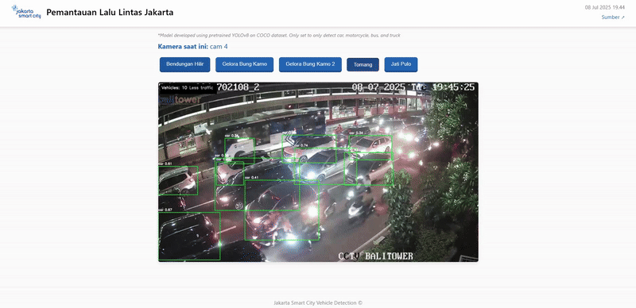

# Near Real-Time Vehicle Detection from Jakarta’s Traffic CCTVs
## 📖 Introduction
Developed a web-based application for real-time vehicle detection using pretrained YOLOv8 on live public CCTV streams from Jakarta. The system detects cars, motorcycles, buses, and trucks directly from .m3u8 video feeds and displays the results in a browser interface using Flask. It includes:
🔲 Live stream switching between multiple CCTV sources
🔲 Vehicle count overlay on video
🔲 Traffic condition classification (e.g. No traffic, Less traffic, Crowded)
🔲 Responsive UI with loading animation and timestamp
🔲 Optional public access via Cloudflare Tunnel for remote testing
## 🧠 Results with YOLOv8nano

This🛠️ This project uses the smallest YOLOv8 model to enable near real-time predictions. While the detections may not always be perfect due to the lightweight nature of the model especially on low-light condition, it demonstrates strong potential for efficient and scalable traffic monitoring solutions.
